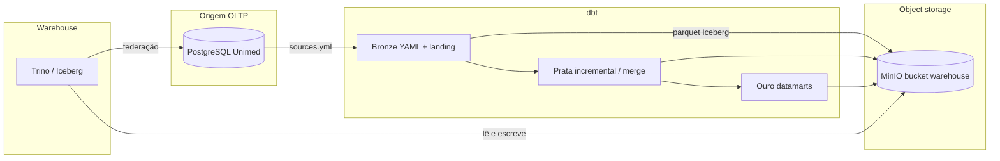

# PoC dbt + lakehouse Unimed

Ambiente local de demonstracao: **dbt** no padrao medalhao (bronze / prata / ouro), lendo um **PostgreSQL** operacional e gravando as tabelas em **MinIO (S3)**. As consultas sao feitas no **Trino**, que funciona como o data warehouse SQL conectado ao bucket — o mesmo papel que o Snowflake exerceria em producao.

Nesta PoC ninguem precisa criar conta cloud nem configurar catalogo, bucket ou seed na mao. Depois do `pip install`, um comando sobe tudo ja com dados.

## Arquitetura



| Camada | Papel nesta PoC | Equivalente em producao |
| --- | --- | --- |
| PostgreSQL | Sistema de origem com tabelas e inserts de exemplo | ERP / SIS / legado da operadora |
| MinIO | Bucket S3 local `warehouse` | AWS S3 / Azure Blob |
| Trino + Iceberg | Warehouse SQL sobre o bucket | Snowflake (external tables / Iceberg) |
| dbt | Transformacoes bronze → prata → ouro | dbt-snowflake no mesmo desenho de pastas |

## Pre-requisitos

- **Docker Desktop** instalado e em execucao (Compose v2). Sem o Docker o comando unico nao consegue criar Postgres, MinIO e o warehouse.
- Python 3.10+ (inclui 3.14; o `requirements.txt` usa dbt 1.12 por causa disso)

O `start.py` nao aponta para a pasta de ninguem. Ele procura o `docker` nesta ordem: PATH, locais padrao de instalacao (Program Files, AppData do usuario atual, Homebrew, `/usr/bin`) e, no Windows, ao lado do Docker Desktop se o app estiver aberto. Se estiver em outro lugar, use a variavel `DOCKER_BIN`.

## Subir a PoC

```bash
pip install -r requirements.txt
python start.py
```

Esse comando sobe so o ambiente (nao executa dbt):

1. Postgres, MinIO (bucket `warehouse`), catalogo Iceberg e Trino
2. Schemas da operadora e dados ficticios no Postgres
3. Schemas Iceberg no bucket, prontos para o dbt ler a origem e gravar bronze/prata/ouro

Quando o ambiente estiver no ar:

```bash
dbt run --profiles-dir . --project-dir .
```

## O que sobe

| Servico | URL / conexao | Credencial |
| --- | --- | --- |
| Postgres origem | `localhost:5433` database `unimed` | `unimed` / `unimed` |
| MinIO API | http://localhost:9000 | bucket `warehouse` |
| MinIO browser | http://localhost:9001 | sobe com o `start.py` |
| Trino UI | http://localhost:8080 | user `dbt`, sem senha |
| Trino DBeaver/JDBC | host `localhost` porta `8080` catalogo `iceberg` | user `dbt` |

Depois do `dbt run`, os arquivos Parquet/Iceberg aparecem no console do MinIO dentro de `warehouse/`. As consultas continuam sendo SQL no Trino, nao leitura direta do S3.

## Consultar os datamarts

```bash
python consultas.py
```

Ou no Trino UI / DBeaver:

```sql
select * from iceberg.cuidado_integrado_ouro.mart_cuidado_integrado;
select * from iceberg.resultados_exames_ouro.mart_exames_criticos;
select * from iceberg.autorizacoes_ouro.mart_autorizacoes_sla;
select * from iceberg.faturamento_ouro.mart_faturamento_competencia;
```

A origem continua acessivel via federacao:

```sql
select * from postgres.cuidado_integrado.beneficiarios;
```

## Modelos dbt

Cada pasta em `dbt_models_unimed/` e um dominio (schema de negocio). Dentro dela: `bronze`, `prata` e `ouro`.

```
dbt_models_unimed/
  cuidado_integrado/
    bronze/   _sources.yml + landing SQL (Postgres → MinIO)
    prata/    incremental merge e append
    ouro/     dim/fato/mart
  resultados_exames/
  autorizacoes/
  faturamento/
```

- **Bronze**: YAML de source (tabela, schema, descricao de colunas) apontando para o Postgres. Os `.sql` copiam a origem para Iceberg no bucket, com `_ingested_at` e `_source_system`.
- **Prata**: limpeza, padronizacao e regras. Parte dos modelos usa `incremental + merge`; eventos (acompanhamentos, pedidos, itens) usam `incremental + append`.
- **Ouro**: datamarts lendo a prata (`dim_beneficiario`, `fato_*`, `mart_*`).

Comandos uteis:

```bash
dbt run --profiles-dir . --project-dir .
dbt run -s mart_cuidado_integrado --profiles-dir . --project-dir .
dbt test --profiles-dir . --project-dir .
dbt run --full-refresh --profiles-dir . --project-dir .
```

## Parar / resetar

```bash
python start.py down
```

Para apagar volumes (dados do Postgres e do MinIO) e comecar do zero:

```bash
docker compose down -v
python start.py
```
